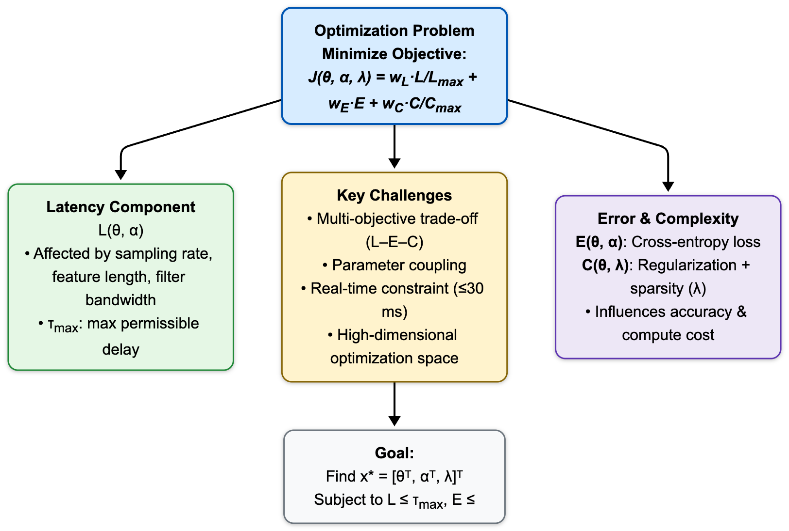

# BCI Latency Optimization Framework

A comprehensive multi-objective optimization framework for minimizing processing latency in Brain-Computer Interface (BCI) systems while preserving classification accuracy and computational efficiency.

## Overview

This framework addresses the critical challenge of real-time neural signal processing in BCI systems by formulating latency minimization as a constrained optimization problem. The implementation integrates latency, classification error, and model complexity into a unified differentiable objective function, enabling the use of classical deterministic optimization algorithms.

## Key Features

- **Multi-objective Optimization**: Jointly optimizes latency, accuracy, and computational complexity
- **Multiple Optimization Methods**: Implements GD, Newton's Method, BFGS, L-BFGS, NCG, SLSQP, and trust-constr
- **Constraint Handling**: Uses Augmented Lagrangian and penalty-based methods for constraint satisfaction
- **Three Operating Modes**: Real-Time, Balanced, and High-Accuracy configurations
- **Comprehensive Results**: Detailed performance metrics and convergence analysis

## Repository Structure

```
BCI-Latency-Optimization/
├── bcisolver/
│   └── BCIOptimizationFramework.py  # Main optimization framework
├── images/
│   ├── flow.png                      # Problem structure diagram
│   └── enhanced_convergence_plot.png # Convergence analysis plot
├── results/
│   └── bci_optimization_results.csv  # Experimental results
├── README.md                          # This file
├── THEORY.md                          # Theoretical background
├── PROBLEM_FORMULATION.md             # Mathematical formulation
├── RESULTS.md                         # Results analysis
└── requirements.txt                   # Python dependencies
```

## Problem Overview



The optimization framework addresses the multi-objective problem of minimizing latency while preserving accuracy and managing complexity in BCI systems.

## Installation

### Prerequisites

- Python 3.7 or higher
- NumPy
- SciPy
- Matplotlib
- Pandas

### Setup

1. Clone the repository:
```bash
git clone https://github.com/mohshin-shah/BCI-Latency-Optimization.git
cd BCI-Latency-Optimization
```

2. Install dependencies:
```bash
pip install -r requirements.txt
```

## Usage

### Basic Usage

Run the optimization framework:

```python
from bcisolver.BCIOptimizationFramework import run_enhanced_analysis

# Execute optimization across all test cases and methods
results_df = run_enhanced_analysis()
```

### Custom Configuration

```python
from bcisolver.BCIOptimizationFramework import EnhancedBCIOptimizer

# Initialize optimizer
optimizer = EnhancedBCIOptimizer()

# Define test case parameters
case_params = {
    'tau_max': 15.0,      # Maximum latency (ms)
    'ell_max': 0.40,      # Maximum error
    'alpha_min': 20,      # Minimum feature dimension
    'alpha_max': 40       # Maximum feature dimension
}

# Solve using SLSQP
result = optimizer.solve_constrained_optimization(case_params, method='SLSQP')

# Get performance metrics
metrics = optimizer.get_performance_metrics(result.x, case_params)
print(f"Latency: {metrics['latency']:.2f} ms")
print(f"Latency Reduction: {metrics['latency_reduction']:.2f}%")
print(f"Accuracy Delta: {metrics['accuracy_delta']:.2f}%")
```

## Test Cases

The framework evaluates three operating modes:

1. **Real-Time Mode** (`tau_max=15 ms`, `ell_max=0.40`)
   - Optimized for minimal latency
   - Suitable for real-time control applications

2. **Balanced Mode** (`tau_max=25 ms`, `ell_max=0.35`)
   - Balanced trade-off between speed and accuracy
   - General-purpose configuration

3. **High-Accuracy Mode** (`tau_max=40 ms`, `ell_max=0.25`)
   - Prioritizes classification accuracy
   - Suitable for offline analysis or high-precision tasks

## Optimization Methods

The framework implements seven optimization algorithms:

- **Gradient Descent (GD)**: First-order method with linear convergence
- **Newton's Method (NM)**: Second-order method with quadratic convergence
- **BFGS**: Quasi-Newton method with superlinear convergence
- **L-BFGS**: Memory-efficient variant of BFGS
- **Nonlinear Conjugate Gradient (NCG)**: Memory-efficient first-order method
- **SLSQP**: Sequential Least Squares Programming for constrained optimization
- **trust-constr**: Trust-region constrained optimization

## Results

The framework achieves:
- **23-27% latency reduction** across all methods
- **Accuracy preservation** within ±2% of baseline
- **Exact constraint satisfaction** with SLSQP and trust-constr
- **Fast convergence** with L-BFGS (typically 15-25 iterations)

See [RESULTS.md](RESULTS.md) for detailed analysis.

## Documentation

- [THEORY.md](THEORY.md) - Theoretical background and mathematical foundations
- [PROBLEM_FORMULATION.md](PROBLEM_FORMULATION.md) - Detailed problem formulation
- [RESULTS.md](RESULTS.md) - Experimental results and analysis

## License

This project is licensed under the MIT License.

## Author

**Mohshin Shah**  
Department of Artificial Intelligence  
Indian Institute of Technology Jodhpur  
Email: mohshinshah@gmail.com

## References

- BCI Competition IV Dataset 2a
- IEEE Conference Paper (see BCIV2.tex for full references)
